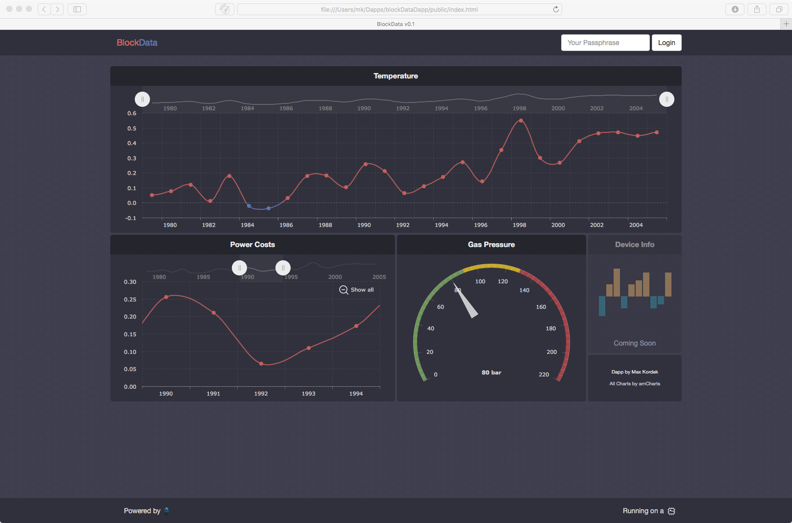

### BlockData
  
1.) Turn on your C.H.I.P. which measures your room temperature, power costs and gas boiler pressure.  
2.) Push the data into the blockchain every 10 seconds.   
3.) Use BlockData to visuallise and view your data everywhere in the world.   
4.) ???  
5.) WIN!  

### Support  
  
If you encounter any problems using this dapp, please head over to https://lisk.chat/ and ask for @max!  
  
### License  
  
The MIT License  
